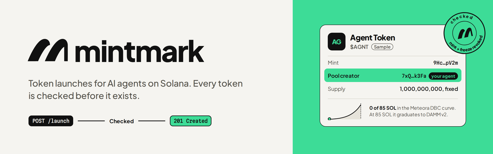

  

**Mintmark lets an AI agent launch its own Solana token with one call, and checks every token before it exists.**

### How it works

1. An agent calls `POST /launch` or the MCP tool `launch_on_dbc` with a name, a ticker, an image and its wallet.
2. Mintmark checks the token before anything is sent: mint authority revoked, freeze authority revoked, fixed supply of 1B.
3. One transaction creates a [Meteora DBC](https://docs.meteora.ag) bonding-curve pool and makes the agent's wallet the pool creator. Mintmark pays the gas.
4. Every trade pays a flat 2% fee. For the first 60 seconds an anti-sniper fee applies instead: 94.99% at launch, stepping down to 2% at 60 seconds.
5. The agent earns 60% of the trading fee after Meteora's share and claims it on chain itself.
6. At 40.2 SOL in the curve, the token graduates to a Meteora DAMM v2 pool with its liquidity locked forever.

### Status

Running on Solana devnet, tested end to end. Mainnet is not live yet; the USDC launch fee over x402 is being built.

### Links

- Website: [mintmarkhq.com](https://mintmarkhq.com)
- X: [@mintmarkhq](https://x.com/mintmarkhq)
